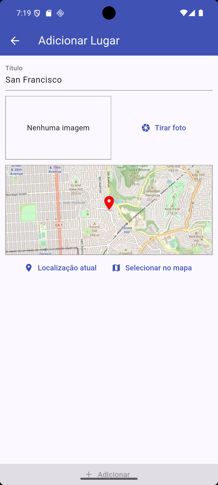
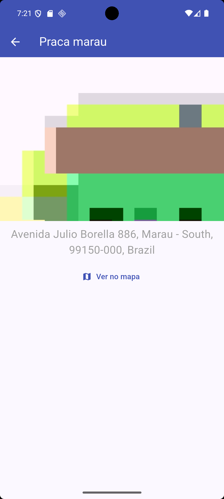

# 🌍📷 Great Places - App de Localização e Câmera

> **Nota:** Este é um projeto de estudo e portfólio desenvolvido para demonstrar conhecimentos práticos em **Flutter**, integração com recursos nativos do dispositivo e persistência de dados.

O **Great Places** é um aplicativo móvel avançado que permite aos usuários gerenciar uma lista de seus "lugares favoritos". O grande foco técnico deste projeto é a integração direta com o Hardware do smartphone e o uso de recursos como a **Câmera, GPS (Localização), renderização de Mapas e Banco de Dados local (SQLite)**.

---

## 📱 Demonstração do App

<p align="center">
  
  
</p>

---

## 🧠 Aprendizados e Conceitos Aplicados

Este aplicativo foi construído utilizando as seguintes abordagens e tecnologias para solucionar desafios reais do desenvolvimento Mobile:

1. **Uso de Câmera Nativa (`image_picker`)**: Acesso à câmera do dispositivo do usuário para tirar e processar fotos em tempo real.
2. **Armazenamento de Arquivos no Sistema (`path_provider`)**: Salvar e ler imagens diretamente do diretório físico seguro do sistema operacional (Android/iOS) e referenciar esse caminho.
3. **Persistência de Dados Offline (`sqflite`)**: Consumo de um Banco de Dados SQL embutido para salvar offline as informações de Cadastro como UUID, Títulos e os Caminhos em Disco das mídias.
4. **Serviços de Geolocalização (`location`)**: Requisição de coordenadas de GPS e controle do fluxo de permissões de localização que são requisitadas do usuário pelo Smartphone.
5. **Integração OpenStreetMap (`flutter_map`)**: Renderização dinâmica de Mapas sem a infraestrutura paga do Google. O usuário tem a capacidade de marcar e navegar livremente pelo mapa. 
6. **Consumo de REST APIs (Geocoding/Reverse Geocoding)**: Utilização do pacote `http` para fazer Fetch de uma Static API que devolve um JPG do mapa estático e requisições para a *Geoapify*, com o intuito de traduzir a LAT/LONG bruta para um endereço numérico (Rua e Cidade).
7. **Gerenciamento de Estado (`provider`)**: A arquitetura e mudanças nas variáveis do SQLite estão vinculadas no ciclo de vida geral usando o padrão *Provider*.

---

## 🛠 Principais Tecnologias e Pacotes

- [Flutter / Dart](https://flutter.dev/) - Framework UI e Linguagem base.
- `provider` - Arquitetura de State Management.
- `sqflite` - Banco de Dados SQLite.
- `location` - Integração com o GPS do Hardware.
- `image_picker` - Integração com a Câmera do Hardware.
- `flutter_map` e `latlong2` - Mecanismo de Mapa e Geometria.
- `http` - Protocolo HTTP Client nativo.

---

## 🔒 Variáveis de Ambiente (API Keys)

A Chave de API de Geocoding foi **removida** deste repositório por questões de segurança de dados.
Caso um avaliador ou outro desenvolvedor queira compilar a aplicação:

1. Acesse: [geoapify.com](https://www.geoapify.com/) e crie uma **API Key** grátis.
2. No código deste projeto, vá para `lib/utils/location_util.dart`.
3. Adicione sua chave na variável designada:
   ```dart
   const GEOAPIFY_API_KEY = 'COLOQUE_SUA_API_KEY_AQUI';
   ```

---

## 🚀 Como Executar o Projeto

1. Clone o repositório.
2. Tenha um Emulador Android/iOS ou um aparelho físico com modo *Debugging* ativo conectado.
3. Obtenha os pacotes rodando o comando na raiz:
   ```bash
   flutter pub get
   ```
4. Gere a API Key da Geoapify (instrução acima) se desejar que a funcionalidade de Mapas funcione perfeitamente.
5. Instale o APP em seu emulador:
   ```bash
   flutter run
   ```

---
*Desenvolvido como projeto de Portfólio para aprofundamento de conhecimento em hardware e serviços de mapa dentro do ecossistema Flutter.*
